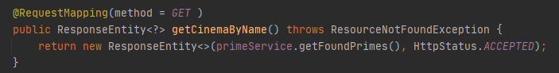
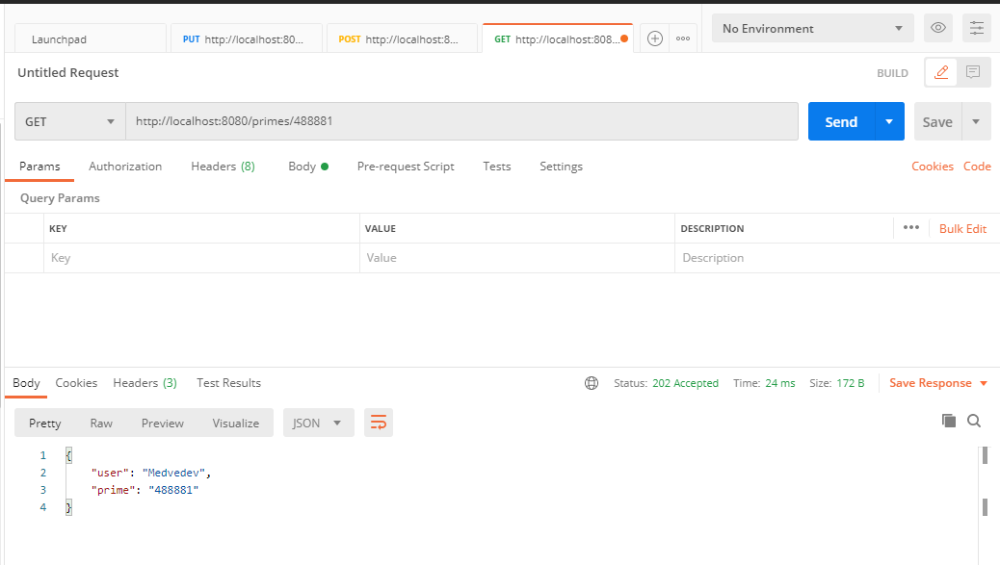
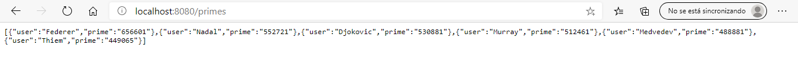
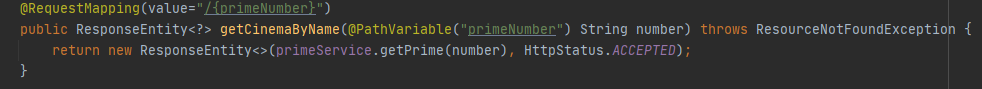
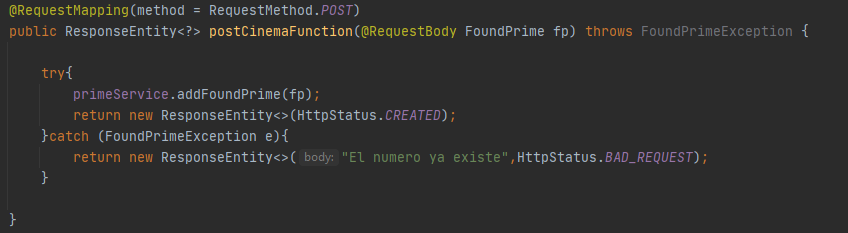
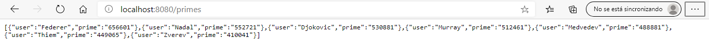
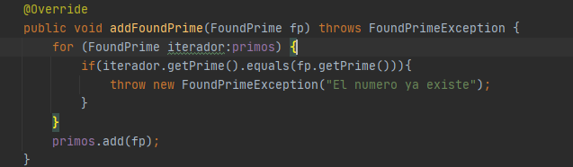
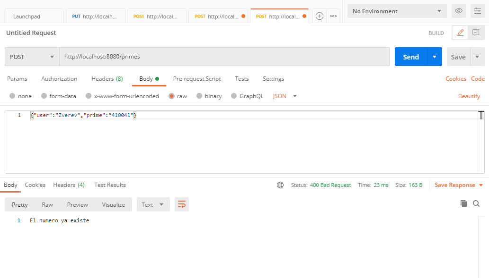
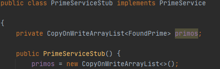

#PrimesApi

> 1. Se soporta el metodo GET para los numeros primos en el recurso /primes:
>
>   
>
>   
>
>   
>
> 2. Se soporta el metodo GET para un numero primo en especifico en el recurso /primes/primeNumber:
>
>   
>
>   
>
> 3. Se soporta el metodo POST para un numero primo nuevo, teniendo en cuenta que no se puede crear uno que ya exista:
>
>   
>
>   
>
> Se modificó el metodo de añadir un numero para que lance la excepción si el numero ya existe de la siguiente forma:
>
>   
>
> Aqui la prueba de que no hace el POST si existe el numero:
>
>   
>
> 4. Para evitar problemas de concurrencia se hizo la lista de primos una lista concurrente para que no existan problemas con los
>verbos HTTP
>
>   
>