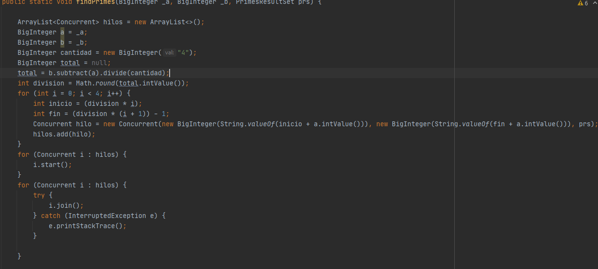
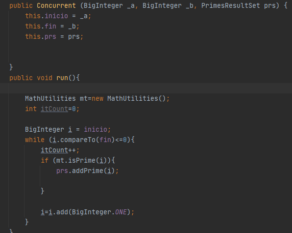
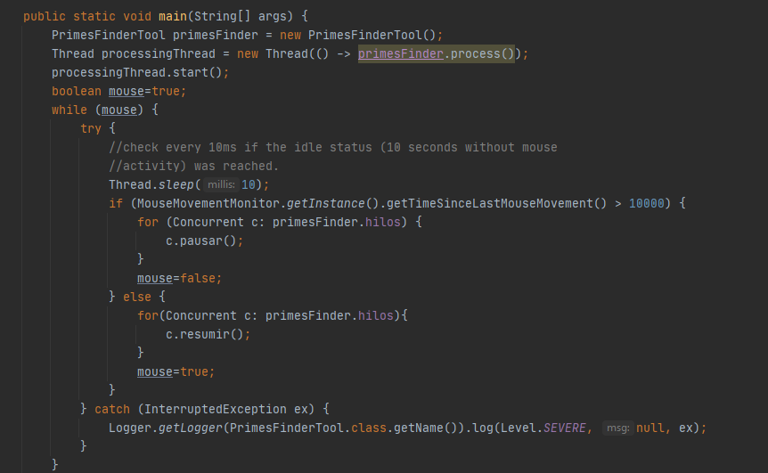

# Concurrent Prime Finder

> 1. El programa divide los intervalos de la siguiente manera:
>
>   
>
>   Una vez se hace la división se creó la clase Concurrent que extiende de Thread y recibira el segmento que le corresponde
>   para calcular los numeros primos en ese segmento de la siguiente manera:
>
>   
>
> 2. Se intento utilizar el evento del mouse, para poder resumir y pausar el programa de la siguiente forma:
>
>   
>
>